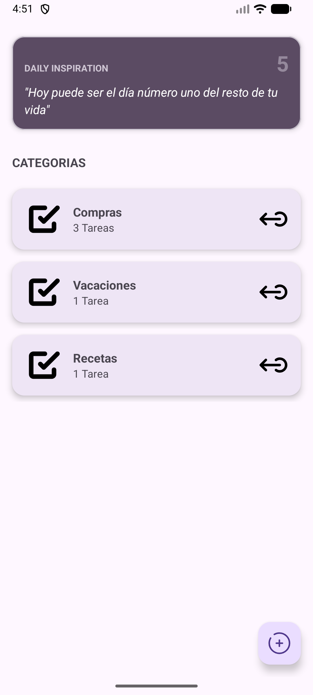
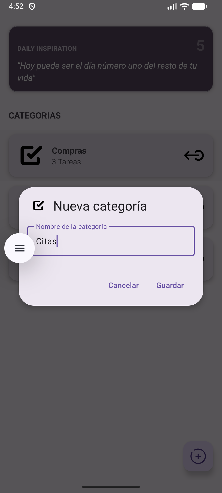
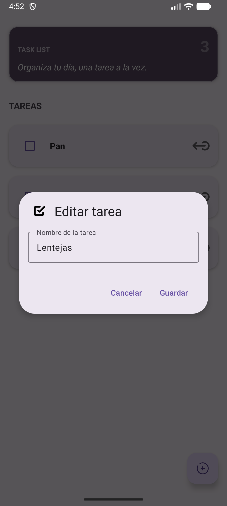
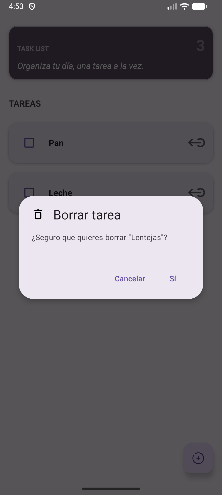

# ✅ TaskList App – Android Kotlin

**Descripción:**  
Aplicación nativa de Android desarrollada en Kotlin para la gestión de tareas diarias (To-Do List), permitiendo crear, editar, eliminar y marcar tareas como completadas con persistencia local y diseño moderno.

El proyecto se ha desarrollado en varias fases, incorporando persistencia con SQLite/Room, mejora de la interfaz de usuario y gestión de estado de las tareas.

---

## 📌 Funcionalidades

### 🔹 v1.0
- Lista de tareas usando **RecyclerView**
- Creación de nuevas tareas
- Marcado de tareas como completadas/pendientes
- Eliminación de tareas
- Persistencia local (SQLite / Room)
- Diseño limpio con **Material Design**

### 🔹 v1.1
- ✏️ Edición de tareas existentes
- 🔍 Búsqueda o filtrado de tareas (opcional)
- 📅 Fecha de creación/vencimiento (opcional)
- ⚡ Mejora de rendimiento en RecyclerView

### 🔹 v1.2 (Planificado)
- 🏷️ Categorías o etiquetas para tareas
- 🔔 Recordatorios y notificaciones
- 🌙 Modo oscuro
- 📊 Estadísticas de productividad

---

## 🛠 Tecnologías utilizadas

- **Kotlin**
- **Android Studio**
- **RecyclerView** + Adaptadores personalizados
- **Room** (Persistencia local)
- **LiveData / ViewModel** (Arquitectura recomendada)
- **Material Design Components**
- **ConstraintLayout**
- **Coroutines** (para operaciones asíncronas)

---

## 📷 Capturas de pantalla

### 🟢 v1.0 – Lista de tareas
<p align="center">
  
  
</p>

### 🔵 v1.1 – Edición y detalles
<p align="center">
  
  
</p>

---

## 📌 Estado del proyecto

El proyecto ha evolucionado en las siguientes fases:

| Versión | Estado | Funcionalidades |
|---------|--------|-----------------|
| v1.0 | ✅ Completado | CRUD básico + RecyclerView + Persistencia |
| v1.1 | ✅ Completado | Edición de tareas + Mejoras UI |
| v1.2 | 🚧 Planificado | Categorías + Recordatorios + Modo oscuro |

---

## 📝 Lo que aprendí

- Implementación de **RecyclerView** con diferentes tipos de vistas
- Persistencia local con **Room Database**
- Uso de **LiveData** y **ViewModel** para arquitectura MVVM
- Operaciones asíncronas con **Coroutines**
- Navegación entre Activities/Fragments
- Gestión de estado de la interfaz de usuario
- Manejo de eventos de usuario (click, long click, checkboxes)
- Actualización eficiente del RecyclerView con DiffUtil

---

## 🚀 Cómo ejecutar

1. Clona el repositorio:

```bash
git clone https://github.com/GualpaJ/TaskList-Android.git
